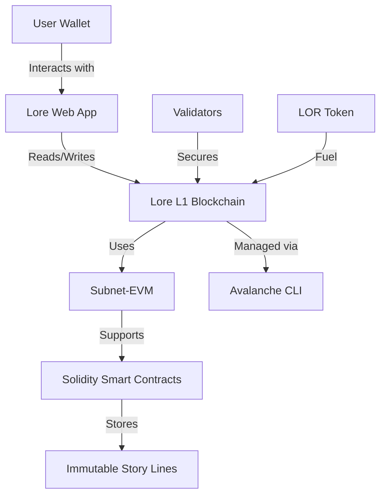

# Lore: Collaborative Storytelling on Avalanche L1


*Fig 1. Lore architecture leveraging Avalanche L1 and Subnet-EVM *

## 🌟 Project Overview
Lore is an experimental blockchain that transforms transactions into collaborative art. Built as an Avalanche L1 subnet, it enables users to:
- Contribute story lines through paid transactions (LOR tokens)
- Create permanent, immutable narratives stored on-chain
- Participate in community-driven storytelling economics

**Core Features**  
✅ EVM-compatible blockchain using Subnet-EVM  
✅ Native LOR token for transaction fees  
✅ Ordered on-chain story storage  
✅ Anti-spam mechanics through token incentives  
✅ Seamless integration with Ethereum tools (MetaMask, Hardhat)

## ⚙️ Technical Architecture


## 🚀 Quick Start Guide

### Prerequisites
- Unix-based OS (Linux/macOS)
- Go 1.23+ (for local node)
- Node.js 18+

### Installation
```bash
# Install Avalanche CLI
curl -sSfL https://raw.githubusercontent.com/ava-labs/avalanche-cli/main/scripts/install.sh | sh -s
echo 'export PATH=~/bin:$PATH' >> ~/.bashrc
source ~/.bashrc
```

### Create Lore Blockchain 
```bash
avalanche blockchain create lore
```
**Configuration Options:**
- VM: Subnet-EVM
- Consensus: Proof-of-Authority (dev mode)
- Chain ID: 251200
- Token Symbol: LOR
- Controller Address: `ewoq` test key

### Deploy Locally
```bash
avalanche blockchain deploy lore --network local
```

## 📜 Smart Contract Structure
```solidity
// StoryRegistry.sol (simplified)
pragma solidity ^0.8.18;

contract LoreStory {
    struct Contribution {
        address author;
        string line;
        uint256 timestamp;
    }
    
    Contribution[] public story;
    uint256 public fee = 0.1 ether; // 0.1 LOR
    
    function addLine(string memory _line) external payable {
        require(msg.value >= fee, "Insufficient LOR");
        story.push(Contribution(msg.sender, _line, block.timestamp));
    }
    
    function getFullStory() external view returns (Contribution[] memory) {
        return story;
    }
}
```

## 🔮 Roadmap
1. **Smart Contract V2**  
   - Dynamic fee adjustments
   - NFT-based chapter rewards
   - Governance voting for story arcs 

2. **Web Interface**  
   - Real-time story visualization
   - Wallet integration (MetaMask/Core)
   - Social features for contributors 

3. **Testnet Deployment**  
   - Fuji Testnet deployment
   - Load testing with 1000+ users
   - Gas optimization analysis 

4. **Mainnet Launch**  
   - Final security audit
   - LOR token distribution plan
   - Community governance setup 

5. **Extended Features**  
   - Cross-chain storytelling via Avalanche Warp Messaging
   - AI-assisted narrative coherence checks
   - Immutable story NFTs 

## 🤝 Contributing
We welcome contributions through:
1. Story contributions (after mainnet launch)
2. Smart contract improvements
3. Frontend development
4. Documentation updates

**First-time contributors** should review our [Contribution Guidelines](CONTRIBUTING.md).

## 📄 License
Apache 2.0 - See [LICENSE](LICENSE) for details

---

*Powered by [Avalanche](https://avax.network) with special thanks to the Subnet-EVM team *  
*Last Updated: 2025-05-22*
```