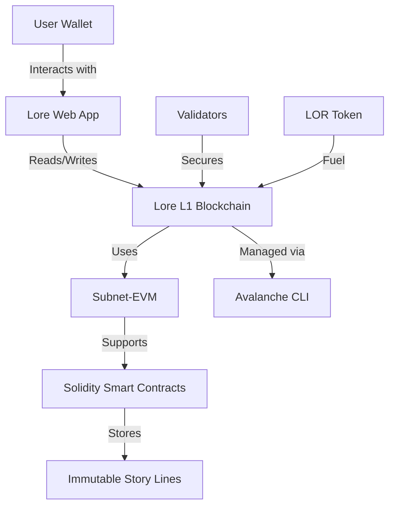

# Lore: Collaborative Storytelling on Avalanche L1

## 🌟 Project Overview
Lore is an experimental blockchain that transforms transactions into collaborative art. Built as an Avalanche L1 subnet, it enables users to:
- Contribute story lines through paid transactions (LOR tokens)
- Create permanent, immutable narratives stored on-chain
- Participate in community-driven storytelling economics

**Core Features**  
✅ EVM-compatible blockchain using Subnet-EVM  
✅ Native LOR token for transaction fees  
✅ Ordered on-chain story storage  
✅ Anti-spam mechanics through token incentives  
✅ Seamless integration with Ethereum tools (MetaMask, Hardhat)

## ⚙️ Technical Architecture


## 🚀 Quick Start Guide

### Prerequisites
- Unix-based OS (Linux/macOS)
- Go 1.23+ (for local node)
- Node.js 18+

### Installation
```bash
# Install Avalanche CLI
curl -sSfL https://raw.githubusercontent.com/ava-labs/avalanche-cli/main/scripts/install.sh | sh -s
echo 'export PATH=~/bin:$PATH' >> ~/.bashrc
source ~/.bashrc
```

### Create Lore Blockchain 
```bash
avalanche blockchain create lore
```
**Configuration Options:**
- VM: Subnet-EVM
- Consensus: Proof-of-Authority (dev mode)
- Chain ID: 251200
- Token Symbol: LOR
- Controller Address: `ewoq` test key

### Deploy Locally
```bash
avalanche blockchain deploy lore --network local
```

## 🔮 Roadmap

1. **Blockchain & Smart Contract**  
   - Completed creation of the Lore blockchain  
   - Developed and deployed the LoreStory smart contract  

2. **LOR Token Development**  
   - Design and deployment of the native LOR token  
   - Integration of LOR token payments within the LoreStory contract  
   - Tokenomics and distribution strategy  

3. **Smart Contract V2 Enhancements**  
   - Dynamic fee adjustments based on network activity  
   - NFT-based chapter rewards to incentivize contributors  
   - Governance voting mechanisms for story arc decisions  

4. **User Interface & Experience**  
   - Development of a web interface with real-time story visualization  
   - Wallet integration (MetaMask, Core Wallet, etc.)  
   - Social features to enhance community engagement  

5. **Testnet & Mainnet Milestones**  
   - Deployment on Avalanche Fuji Testnet  
   - Load and gas optimization testing with a growing user base  
   - Final security audits and mainnet launch preparations  

6. **Future Innovations**  
   - Cross-chain storytelling enabled by Avalanche Warp Messaging  
   - AI-powered tools for narrative coherence and moderation  
   - Creation of immutable story NFTs for contributors and collectors  


## 🤝 Contributing

We warmly welcome contributions in the following ways:

1. Crafting and expanding the collaborative story (post-mainnet launch)  
2. Enhancing and optimizing smart contract logic and security  
3. Developing integration tools and utilities for better interaction  
4. Designing engaging community events and challenges to boost participation  

If you're passionate about storytelling, blockchain tech, or community building, your skills are invaluable here!

